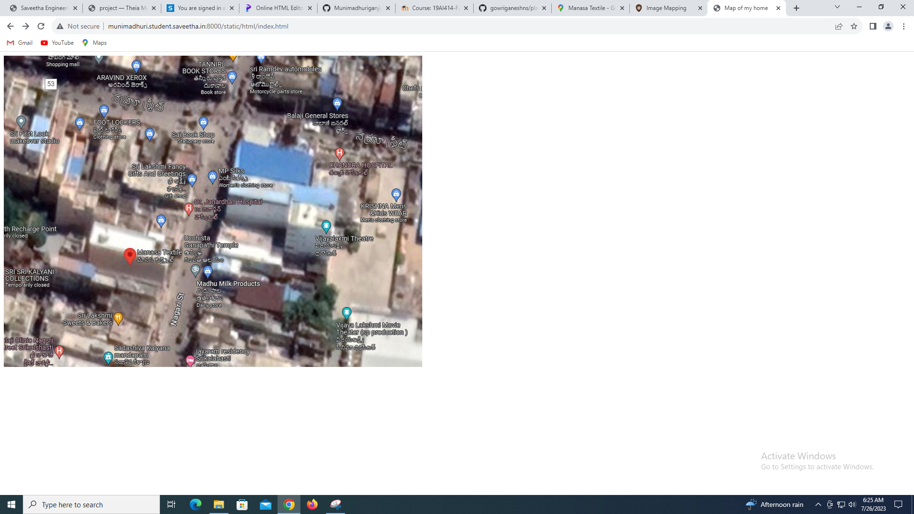
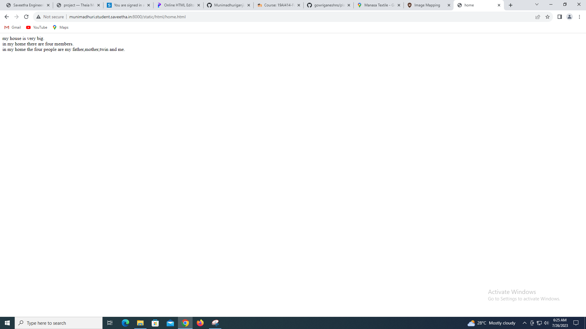
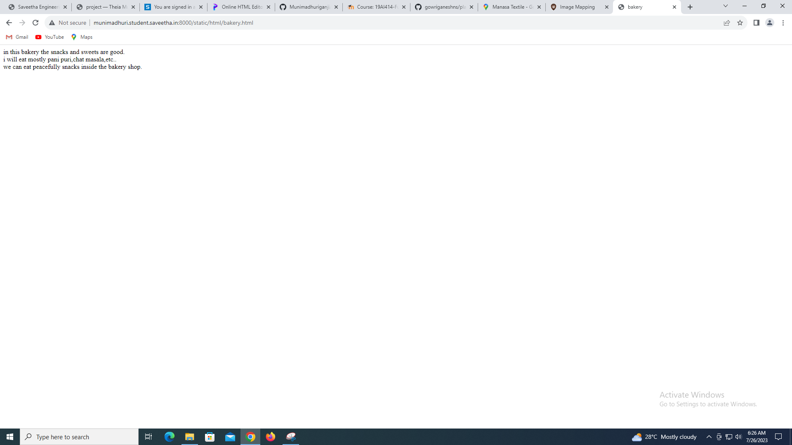

# Places Around Me
## AIM:
To develop a website to display details about the places around my house.

## Design Steps:

### Step 1:Create a folder 'static' under the project folder 'myproj'

### Step 2:In 'static',create another folder 'html',under which the file 'index.html' should be created.

### Step 3:Go to google maps and take a screenshot of your home on it along with some places around it.

### step 4:Go to image-maps.com and make 5 locations on it using the shapes used in maps.

### step 5:Copy the html code for the map and add it to 'index.html'

### step 6:Create the html documents to be displayed when clicked on the location in the image map.

### step 7:Take screenshots of the output.

### step 8:Push it to 'README.md' and push it to the repository.

## Code:
### index.html
```html
<!DOCTYPE html>
<html>
    <head>
        <title>Map of my home</title>
    </head>
    <body>
        
        <map name="image-maps-2023-07-26-055005" id="ImageMapsCom-image-maps-2023-07-26-055005">
        <area  alt="" title="home" href="home.html" shape="rect" coords="115,259,206,353" style="outline:none;" target="_self"     />
        <area  alt="" title="theatre" href="theatre.html" shape="rect" coords="599,329,710,427" style="outline:none;" target="_self"     />
        <area  alt="" title="bakery" href="bakery.html" shape="rect" coords="140,499,274,597" style="outline:none;" target="_self"     />
        <area  alt="" title="movie" href="movie.html" shape="rect" coords="671,516,831,614" style="outline:none;" target="_self"     />
        <area  alt="" title="gifts" href="gifts.html" shape="rect" coords="262,208,391,306" style="outline:none;" target="_self"     />
        <area shape="rect" coords="877,652,879,654" alt="Image Map" style="outline:none;" title="Image Map" href="https://www.image-maps.com/" />
        </map>
    </body>
</html>
```
### home.html
```html
<!DOCTYPE html>
<html>
    <head>
        <title>home</title>
    </head>
    <body>
        my house is very big.
        <br>
        in my home there are four members.
        <br>
        in my home the four people are my father,mother,twin and me.
    </body>
</html>
```

### gifts.html
```html
<!DOCTYPE html>
<html>
    <head>
        <title>gifts</title>
    </head>
    <body>
        it is a very famous shop.
        <br>
        in this shop there are gifts , greeting cards,etc..
        <br>
        mostly in this shop all the gifts are good.
    </body>
</html>
```
### movie.html
```html
<!DOCTYPE html>
<html>
    <head>
        <title>movie</title>
    </head>
    <body>
        in my place it is the very big movie theater.
        <br>
        i see most of movies in this theater.
        <br>
        it is a very comfatable theater.
    </body>
</html>
```
### theater.html
```html
<!DOCTYPE html>
<html>
    <head>
        <title>theater</title>
    </head>
    <body>
        this theate is very near to my place.
        <br>
        it also a good theater.
        <br>
        it is the second best theater in my place.
    </body>
</html>
```
### bakery.html
```html
<!DOCTYPE html>
<html>
    <head>
        <title>bakery</title>
    </head>
    <body>
        in this bakery the snacks and sweets are good.
        <br>
        i will eat mostly pani puri,chat masala,etc..
        <br>
        we can eat peacefully snacks inside the bakery shop.
    </body>
</html>
```

## Output:
### index.html


### home.html


### gifts.html


### movie.html


### theater(theater.png)


### bakery.html


## Result:
Write your result